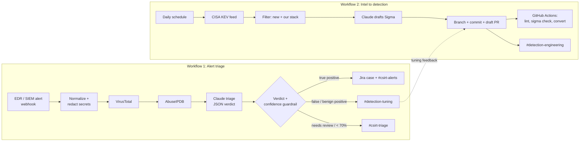

# TIDE Automation: AI-assisted triage and detection engineering with n8n + Claude

Two security automation pipelines, built as code, that model how a Threat Intelligence and Detection
Engineering (TIDE) team supports incident response:

1. **Alert Triage & Enrichment**: EDR/SIEM alert → IOC extraction → threat intel enrichment → Claude triage
   (verdict, ATT&CK mapping, evidence, recommended actions) → routed to a case, a tuning queue or an analyst.
2. **Threat Intel to Detection PRs**: daily CISA KEV feed → filtered to our tech stack → Claude drafts a Sigma
   rule → opened as a draft GitHub PR → CI validates it → a detection engineer reviews and merges.

Every AI output is advisory: low-confidence calls go to a human, containment is only ever *recommended*,
and AI-drafted detections cannot merge without CI passing and human review.

## Architecture



## Repository layout

```
workflows/            n8n workflows as code (importable JSON)
rules/endpoint/       hand-written Sigma detections
rules/kev/            AI-drafted detections land here via PR
sample-alerts/        test payloads for workflow 1
.github/workflows/    CI: Sigma validation, SPL conversion, workflow lint, gitleaks
docker-compose.yml    self-hosted n8n + Postgres
```

## Setup

```bash
cp .env.example .env            # set POSTGRES_PASSWORD and N8N_ENCRYPTION_KEY (openssl rand -hex 32)
docker compose up -d
docker compose exec n8n n8n import:workflow --separate --input=/workflows
```

Open http://localhost:5678 and create these credentials, then select them on each node:

| Credential name | n8n type | Value |
|---|---|---|
| Anthropic API | Header Auth | name `x-api-key`, value your Claude API key |
| VirusTotal API | Header Auth | name `x-apikey` |
| AbuseIPDB API | Header Auth | name `Key` |
| GitHub Token | Header Auth | name `Authorization`, value `Bearer <fine-grained PAT>` (contents + pull requests: write, this repo only) |
| Jira | Basic Auth | email + API token |
| Slack | Slack API | bot token with `chat:write` |
| Webhook Auth | Header Auth | e.g. name `X-Webhook-Token`, value a long random string |

Then edit the placeholders: the Jira URL and project key (`Create Jira Case` / `Format Messages`), the GitHub
`OWNER`/`REPO` (`Parse Sigma Rule`), the Slack channels, and the `WATCHLIST` (`Filter New & Relevant`).

## Test workflow 1

Activate the workflow, then:

```bash
curl -s -X POST http://localhost:5678/webhook/edr-alert \
  -H "Content-Type: application/json" \
  -H "X-Webhook-Token: <your token>" \
  --data @sample-alerts/falcon-powershell-cradle.json
# → {"alert_id":"ldt:...","verdict":"true_positive","confidence":88,"severity":"high"}
```

The sample uses the EICAR test hash and a public Tor exit IP, so enrichment returns real hits. The
`debug` field contains a fake API key to demonstrate redaction before data leaves the environment.

In production, the alert source would be a Falcon Fusion workflow (or any SIEM) calling the webhook,
or a scheduled pull from the EDR's detections API.

## Design decisions

- **Structured output, not chat.** Claude returns a fixed JSON schema, so routing is deterministic and
  every verdict is auditable in n8n's execution history.
- **Fail safe.** API errors, timeouts or unparseable responses become `needs_review`; nothing silently drops.
- **Confidence guardrail.** Verdicts under 70% are downgraded to human review (tunable in `Parse Verdict`).
- **Data minimization.** Secrets are redacted and private IPs excluded before any external API call.
  n8n is self-hosted and bound to localhost.
- **Detections as code.** AI drafts arrive as *draft* PRs with a reviewer checklist; CI enforces syntax and
  backend conversion; status stays `experimental` until promoted.
- **Closing the loop.** False-positive verdicts carry a concrete tuning suggestion to `#detection-tuning`,
  giving detection engineers a ranked source of noise to fix.

## Metrics worth tracking

Mean time to triage (before vs. after), share of alerts auto-routed vs. sent to humans, analyst agreement
rate with AI verdicts (sample weekly), false-positive rate per detection, and KEV-to-detection lead time.

## Roadmap

- Human-approved containment: Slack "send and wait for approval" → EDR host isolation via API
- More enrichment: internal asset inventory/CMDB, identity provider sign-in history, passive DNS
- Detection testing: run Atomic Red Team emulations and assert the rule fires before merge
- Infrastructure as Code: Terraform for the host, secrets manager for credentials, n8n workflow sync from main
- Cost control: route high-volume, low-severity alerts to a smaller, faster model
